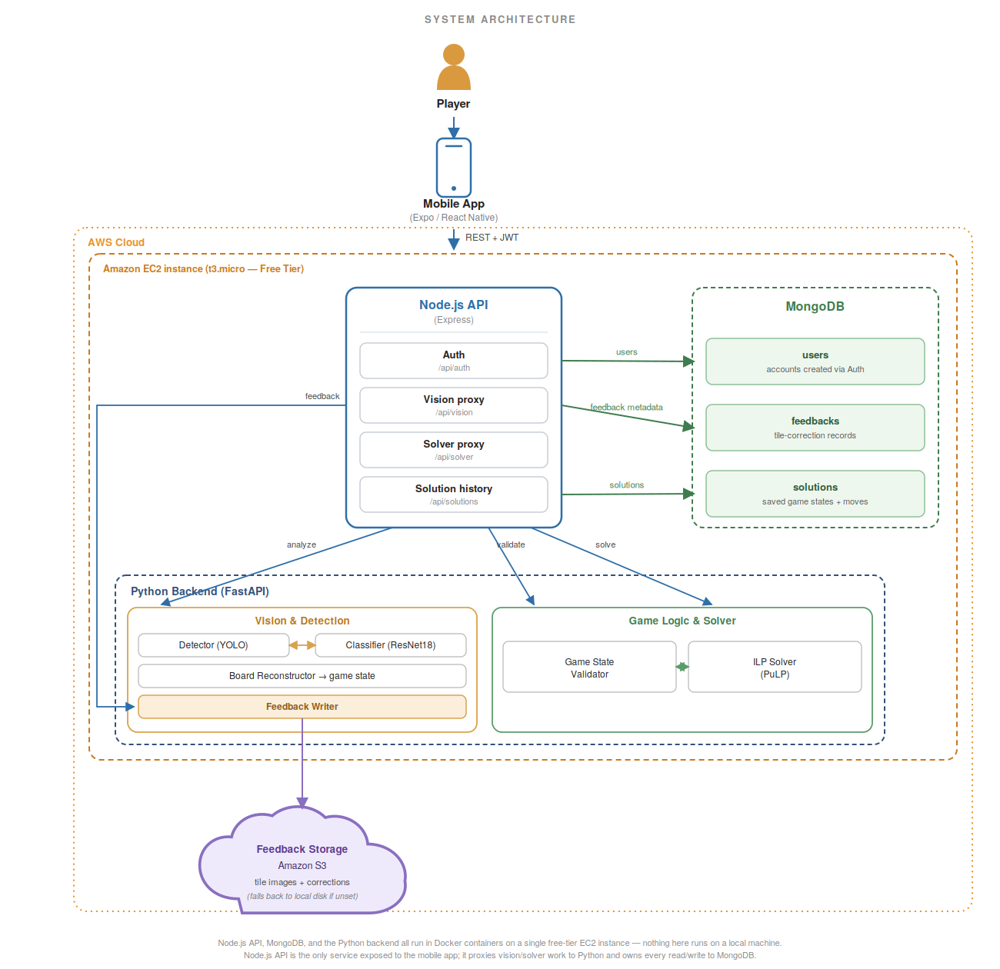

# Rummikub Solver

An AI-powered mobile assistant that finds the optimal move in a Rummikub game from a photo.

Take a picture of your rack and the shared board — the app detects every tile, lets you fix any mistakes, then solves the board and shows you exactly what to play.

---

## Table of Contents

- [Overview](#overview)
- [Features](#features)
- [Architecture](#architecture)
- [Tech Stack](#tech-stack)
- [Project Structure](#project-structure)
- [Setup and Running](#setup-and-running)
- [API Documentation (Swagger)](#api-documentation-swagger)
- [Cloud Storage (AWS S3)](#optional--cloud-storage-for-vision-feedback-aws-s3)
- [Cloud Deployment (AWS EC2)](#cloud-deployment-aws-ec2)
- [Testing](#testing)
- [Application Flow](#application-flow)

---

## Overview

Rummikub requires analyzing a complex, constantly changing board and figuring out how to rearrange existing sets to play as many of your own tiles as possible. This is a hard combinatorial problem.

This app solves it by:

1. Taking photos of the board and your rack
2. Detecting and classifying every tile using computer vision (YOLOv8 + ResNet18)
3. Letting you review and correct any detection errors
4. Running an ILP solver to find the move that plays the maximum number of tiles from your rack
5. Walking you through the move step by step with an interactive simulation

---

## Features

**Vision and Detection**
- Photo-based tile detection using a fine-tuned YOLOv8 model
- Tile classification into 53 classes (4 colors x 13 values + joker) using ResNet18
- Automatic rack region detection using HSV color segmentation
- Duplicate detection filtering via IoU

**Review and Editing**
- Read-only review screen showing the detected rack and board
- Full tile editor — change color, number, or type (regular/joker)
- Add tiles the model missed
- Remove false positive detections
- Merge two board sets or move a tile between sets
- Vision overlay editor — tap bounding boxes directly on the original photo to edit
- Undo support for all edits

**Game Logic and Validation**
- Real-time board validation (runs, groups, joker handling)
- Duplicate tile detection (max 2 copies of any tile, max 2 jokers)
- Full joker support in validation and solving

**Solver**
- ILP solver maximizing the number of rack tiles played
- Board rearrangement — existing sets can be split and recombined freely
- Step-by-step interactive simulation with live rack and board updates

**App**
- User authentication (JWT-based)
- Solution history — view any previously solved game
- Cross-platform mobile app (iOS and Android via Expo Go)
- Model feedback loop — corrections you make while editing are stored as labeled training examples for future retraining, either on local disk or in Amazon S3

---

## Architecture

<p align="center">
  
</p>

The system is a three-tier architecture with an optional cloud storage layer:

- **Mobile app** (React Native + Expo) — captures the rack/board photos, renders the review and simulation screens, and talks to the API gateway over HTTP.
- **Node.js / Express API gateway** — the single entry point for the mobile app. Owns authentication (signup/login, JWT issuance and verification), forwards vision and solver requests to the Python service, and persists users, solved-solution history, and vision feedback in MongoDB. This is also where the OpenAPI/Swagger docs are served.
- **Python / FastAPI service** — stateless compute service that does the actual work: the vision pipeline (rack region detection, YOLOv8 tile detection, ResNet18 classification) and the ILP solver. It has no direct knowledge of users or auth; the Node gateway proxies requests to it.
- **MongoDB** — stores user accounts, saved solutions, and vision-feedback metadata.
- **Amazon S3** *(optional)* — when configured, tile-correction feedback (the image plus the correction JSON) is written to a private S3 bucket instead of local disk, so it isn't lost when a container restarts.

The whole stack (MongoDB, Node API, Python service) is deployed on a single **AWS EC2** free-tier instance — see [Cloud Deployment](#cloud-deployment-aws-ec2) below. Locally, the same stack runs with a single `docker compose up`.

---

## Tech Stack

| Layer | Technology |
|---|---|
| Mobile app | React Native, Expo, TypeScript |
| API gateway | Node.js, Express, TypeScript, JWT auth |
| Vision & solver service | Python, FastAPI |
| Computer vision | YOLOv8 (Ultralytics), ResNet18 (PyTorch/torchvision), OpenCV |
| Optimization | PuLP (Integer Linear Programming) |
| Database | MongoDB |
| API documentation | Swagger UI / OpenAPI 3.0 (`swagger-jsdoc` on the gateway, native FastAPI docs on the vision service) |
| Cloud | AWS S3 (feedback storage), AWS EC2 (free-tier deployment) |
| Containerization | Docker, Docker Compose |
| Testing | pytest + `requests` (integration tests against a live stack) |

---

## Project Structure

```
rummikub-project/
├── backend/                    # Python FastAPI — vision + logic
│   ├── main.py                 # FastAPI app, routes, /storage-status
│   ├── logic/                  # ILP solver, validation, move explainer
│   │   ├── solver_ilp.py
│   │   ├── logic.py
│   │   └── explainer.py
│   └── vision/                 # Detection, classification, rack region, feedback
│       ├── vision_pipeline.py
│       ├── detector_service.py
│       ├── classifier_service.py
│       ├── rack_region.py
│       ├── feedback_service.py
│       └── s3_storage.py       # boto3 wrapper for optional S3 storage
│
├── api/                         # Node.js Express API gateway
│   └── src/
│       ├── config/              # DB connection, JWT config, Swagger definition
│       ├── controllers/         # Auth, vision, solver, solution-history
│       ├── routes/               # Express routers with @swagger doc blocks
│       ├── services/             # Vision proxying, feedback, image normalization
│       ├── models/               # Mongoose models (User, Solution, VisionFeedback)
│       └── middleware/           # JWT auth middleware
│
├── mobile/                       # React Native + Expo
│   ├── app/
│   │   ├── (auth)/               # Login, signup
│   │   └── (main)/
│   │       ├── (tabs)/           # Home tab
│   │       ├── review-edit.tsx   # Tile/board editor
│   │       ├── solution.tsx      # Solver result screen
│   │       ├── simulation.tsx    # Step-by-step move simulation
│   │       └── history.tsx       # Solution history
│   ├── components/
│   ├── context/
│   ├── services/                 # api.ts — typed API client (axios)
│   └── types/
│
├── tests/                        # Integration tests (pytest, run against docker compose)
│   ├── test_api_integration.py
│   └── fixtures/                 # Sample rack/table photos used by the tests
│
├── docs/
│   └── architecture-diagram.png
│
└── docker-compose.yml
```

---

## Setup and Running

### Prerequisites

- [Docker Desktop](https://www.docker.com/products/docker-desktop/)
- [Expo Go](https://expo.dev/go) installed on your mobile device
- Your phone and computer on the **same Wi-Fi network**

---

### Step 1 — Clone the repository

```bash
git clone https://github.com/razemanoel/rummikub-project.git
cd rummikub-project
```

---

### Step 2 — Find your local IP address

**Windows:**
```powershell
ipconfig
```

Look for the IPv4 address on your Wi-Fi adapter, e.g. `10.100.102.11`.

---

### Step 3 — Set your local IP in two places

Create the mobile environment file:

```bash
touch mobile/.env
```

Open `mobile/.env` in your editor and paste:

```env
EXPO_PUBLIC_API_URL=http://YOUR_IP:3000/api
```

Then open `docker-compose.yml` and replace:

```yaml
- REACT_NATIVE_PACKAGER_HOSTNAME=YOUR_IP
```

---

### Step 4 — Run

**First run:**
```bash
docker compose up --build
```

**Subsequent runs:**
```bash
docker compose up
```

This starts 4 containers:

| Container | Port | Description |
|---|---|---|
| `rummikub-mongo` | 27017 | MongoDB |
| `rummikub-python-backend` | 8000 | Vision and logic server |
| `rummikub-node-api` | 3000 | REST API gateway |
| `rummikub-mobile` | 8081, 19000-19002 | Expo dev server |

All dependencies install automatically inside Docker — no manual `pip install` or `npm install` needed.

---

### Step 5 — Connect your phone

1. Wait for the Expo QR code to appear in the terminal
2. Open Expo Go on your phone
3. Scan the QR code

---

### Stopping

```bash
docker compose down
```

---

## API Documentation (Swagger)

Both backend services expose interactive OpenAPI/Swagger docs once running:

| Service | Swagger UI | Raw OpenAPI JSON |
|---|---|---|
| Node API gateway (auth, vision, solver, solutions) | `http://localhost:3000/api/docs` | `http://localhost:3000/api/docs.json` |
| Python vision/solver service | `http://localhost:8000/docs` | `http://localhost:8000/openapi.json` |

Protected endpoints on the Node API require a JWT: log in via `/api/auth/login` in the docs page, then click **Authorize** and paste the token (`Bearer <token>` is added automatically).

**Node API gateway endpoints** — this is the full surface the mobile app talks to:

| Method | Endpoint | Auth | Description |
|---|---|---|---|
| POST | `/api/auth/signup` | — | Create an account |
| POST | `/api/auth/login` | — | Log in, get a JWT |
| GET | `/api/auth/profile` | JWT | Get the logged-in user's profile |
| POST | `/api/vision/analyze` | JWT | Upload rack/board photos, get back detected tiles |
| POST | `/api/vision/feedback` | JWT | Submit a manual tile correction as a training example |
| GET | `/api/vision/health` | JWT | Check that the Python vision service is reachable |
| POST | `/api/solver/solve` | JWT | Get the optimal move for a given `GameState` |
| POST | `/api/solver/validate` | JWT | Validate a `GameState` (runs, groups, joker rules) |
| POST | `/api/solutions` | JWT | Save a solved game state |
| GET | `/api/solutions` | JWT | List the logged-in user's saved solutions |

Every one of these is documented in full (request/response schemas, status codes) in the Swagger UI above — this table is just the quick-reference version.

---

## Optional — Cloud storage for vision feedback (AWS S3)

When you correct a tile detection in the review/edit screens, the app saves the photo and the correction as a training example ("vision feedback"), so the models can be retrained later. By default these are saved to local disk (`backend/vision/feedback_dataset/raw/`). They can be stored in **Amazon S3** instead:

1. Create an S3 bucket with **Block all public access** enabled, and an IAM user/policy scoped to just that bucket (`s3:PutObject`, `s3:GetObject`, `s3:DeleteObject`, `s3:ListBucket` on that one bucket's ARN — never broader).
2. Copy `backend/.env.example` to `backend/.env` and fill in the IAM user's access key, secret key, region, and bucket name. `backend/.env` is git-ignored — never commit real AWS credentials.
3. `docker compose up --build` — the Python service picks up S3 automatically once `S3_BUCKET_NAME` is set.
4. Check `http://localhost:8000/storage-status` — it reports `{"backend": "s3", "bucket": "..."}` when wired up correctly, or `{"backend": "local-disk", "bucket": null}` otherwise.

If `backend/.env` is missing or any of the AWS variables are unset, the app falls back to local disk automatically — no AWS account is required to run the project.

---

## Cloud Deployment (AWS EC2)

The full backend stack — MongoDB, the Node.js API gateway, and the Python vision/solver service — has been deployed and verified end-to-end on a **free-tier AWS EC2 instance**, running the exact same `docker compose` setup as local development. Getting there involved a few real infrastructure problems, each diagnosed from logs before being fixed:

- **Disk space** — the default 8 GB EBS root volume wasn't enough for the PyTorch/torchvision base image, `node_modules`, and the Docker build cache. Fixed by resizing the EBS volume to 20 GB and extending the partition/filesystem in place (`growpart` + `resize2fs`), with no data loss and no need to recreate the instance.
- **Out-of-memory kills** — the free-tier instance's ~1 GB of RAM wasn't enough to hold both the YOLOv8 detector and the ResNet18 classifier in memory at once, and the Python service was being killed by the Linux OOM killer (confirmed via `dmesg`). Fixed with a 2 GB swap file, at zero additional cost.
- **False client-side timeouts** — the mobile app reported "Request timeout" on the solver step even though the backend logs showed a `200 OK`. The API client was using a 10-second default timeout on the solve/validate calls, which the memory-constrained instance sometimes couldn't beat; the vision endpoints already had a longer allowance. Fixed by giving the solver calls the same generous timeout.

The live instance's address isn't published here on purpose: this is a mobile app (accessed through Expo Go, not a browser), and leaving a public IP in a public README invites unwanted traffic against a free-tier instance with no cost protection beyond the free tier itself. The deployment is demoed live instead.

---

## Testing

Integration tests live in `tests/test_api_integration.py` and run as real HTTP requests against the live stack — no mocking. They mirror the project's core user stories one-to-one:

| Test | User story |
|---|---|
| `test_user_login` | Login |
| `test_upload_game_images` | Upload rack/board photos and get back a detected `GameState` |
| `test_submit_vision_feedback` | Submit a manual correction of a detected tile |
| `test_solve_game_state` | Get the recommended move from the ILP solver |

Two real Rummikub photos (`tests/fixtures/rack.jpg`, `tests/fixtures/table.jpg`) are included so the upload tests exercise genuine detections out of the box.

**To run:**

```bash
docker compose up                                  # from the project root, in another terminal
pip install requests pytest --break-system-packages
pytest tests/test_api_integration.py -v -s
```

---

## Application Flow

A step-by-step walkthrough of the user journey from login to solution.

---

### Step 1 — Authentication

Create a new account or log in with an existing one to access the solver.

 

---

### Step 2 — Upload Photos

Snap a photo of your tile rack and the shared board, then tap **Analyze Photos** to send them for detection.

 

---

### Step 3 — Detection Review

Review a summary of all detected tiles and board sets before solving — tap **Edit** to correct errors or **Solve** to proceed.


---

### Step 4 — Review and Edit Tiles

Inspect every detected tile individually; tap any tile to correct it, add tiles the model missed, or reorganize board sets.

 

---

### Step 5 — Optimal Solution

The ILP solver returns the best possible move — tiles to play, sets to rearrange, and full joker usage explained.

  

---

### Step 6 — Step-by-Step Simulation

Follow the move one action at a time, with the rack and board updated live at each step.

   

---

### Step 7 — History

Browse all previously solved games with timestamps and tile counts, and revisit any past solution.


